# 📱 Bladi - UN ECOSYSTEME TOURISTIQUE NATIONAL POUR LE MAROC 
Ine solution informatique pour la réalisation d'un écosystème touristique national pour le Maroc : une application mobile  accompagnée d'une plateforme admin. Cette solution met en avant le potentiel touristique du Maroc dans son ensemble, offrant ainsi une opportunité de promouvoir le pays en tant que destination touristique attrayante. 
## 🚀 Technologies Utilisées

### 📱 Application Mobile :
- **Langage** :   Dart(Flutter) 
- **Base de données** :  MySQL
- **Autres outils** : Android Studio,xampp,

### 💻 Plateforme Admin :
- **frontend** :   JS, Bootstrap,
- **Backend** :   PHP
- **Base de données** :MySQL
- **Autres outils** : Vs Code, Xampp,
## 📌 Fonctionnalités Principales
### Gestion des endroits touristiques : 
- La solution doit permettre la gestion complète des informations sur les attractions touristiques, les hôtels, les restaurants, les activités culturelles, etc. 
- Les utilisateurs doivent pouvoir accéder à des descriptions détaillées, des photos, d'autres informations pertinentes sur chaque lieu touristique.
### Fonctionnalités de recherche et de filtrage :
- Les utilisateurs doivent pouvoir effectuer des recherches avancées pour trouver des attractions touristiques, des restaurants, etc.,  
- Des options de filtrage doivent être disponibles pour affiner les résultats en fonction des préférences des utilisateurs. 
### Localisation : 
- Intégrer des fonctionnalités de géolocalisation pour faciliter le déplacement dans le Maroc. 

## 💻 Plateforme Admin :
 La plateforme web est un outil d'administration qui accompagne mon application mobile. Cette plateforme permet 
- ✅ de gérer et de mettre à jour les informations relatives aux différents endroits. 
- ✅ Elle offre aux administrateurs un moyen convivial et efficace de gérer les hôtels, les 
restaurants et d'autres endroits. 
### 📸 Captures d'Écran : 
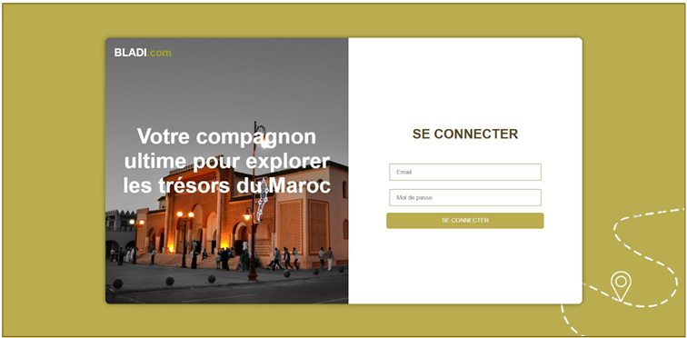 
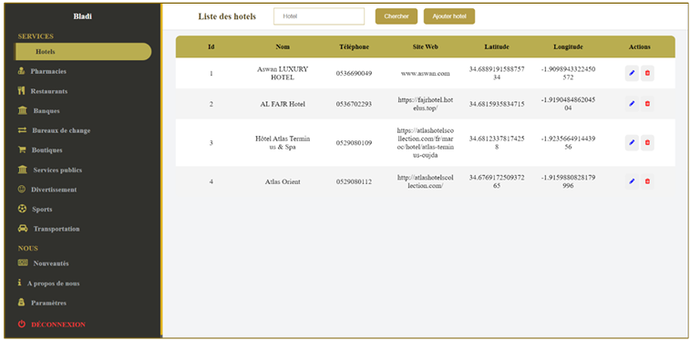 
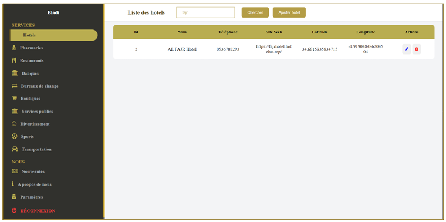 
 
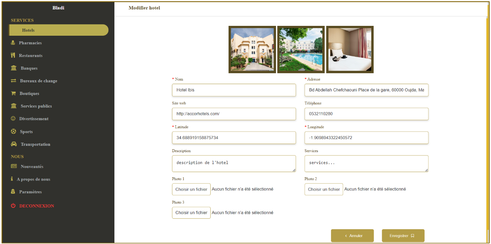 
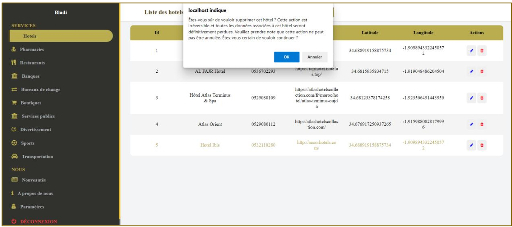 

## 📱 Application Mobile :
Vise à présenter le potentiel touristique du Maroc de manière attrayante et conviviale. Elle offre aux utilisateurs une expérience interactive pour découvrir et explorer les différents endroits du pays.
### 📸 Captures d'Écran
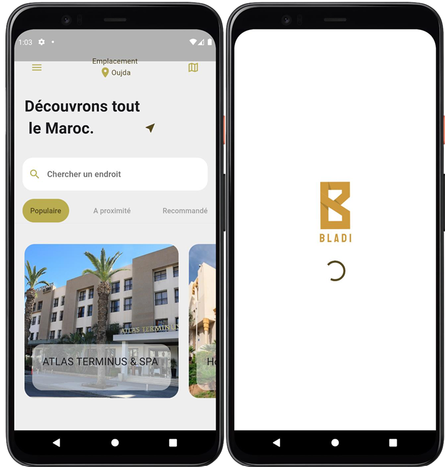 
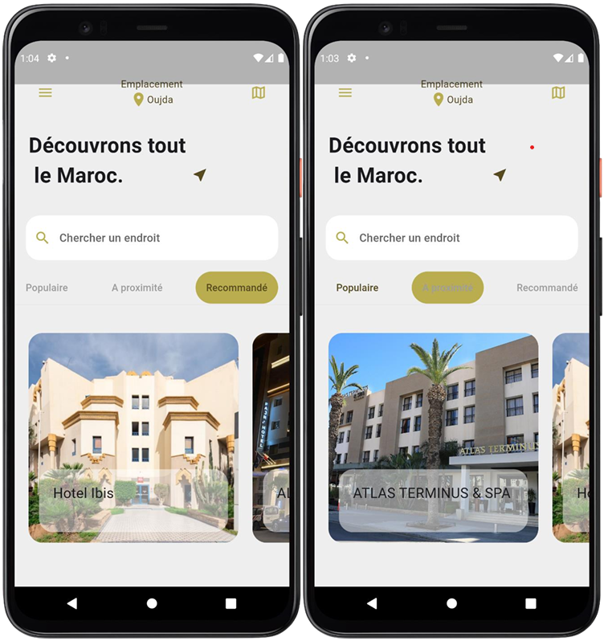 
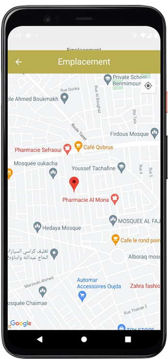 
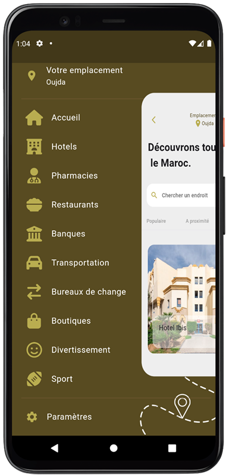 
 
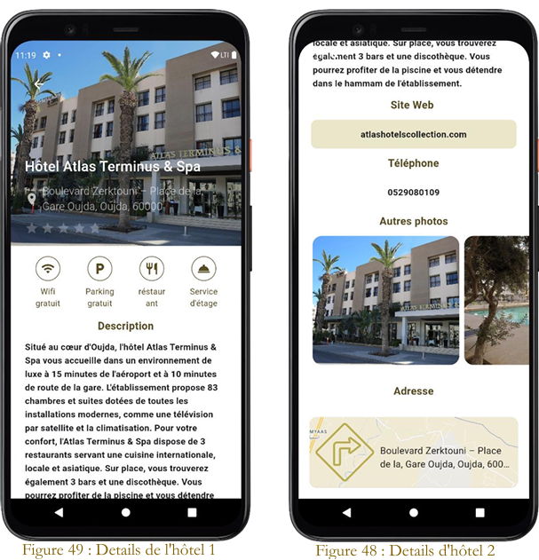 
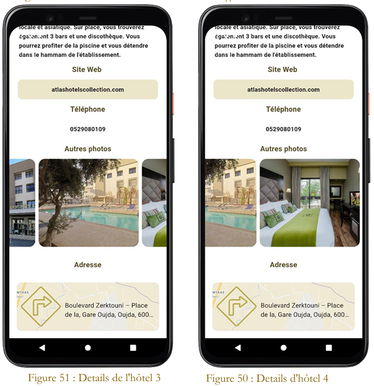 
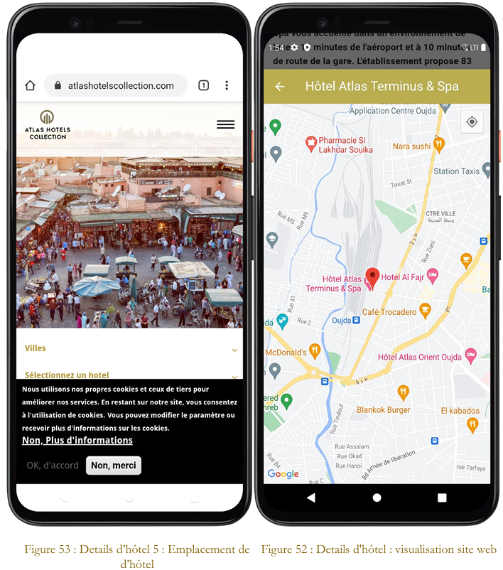 
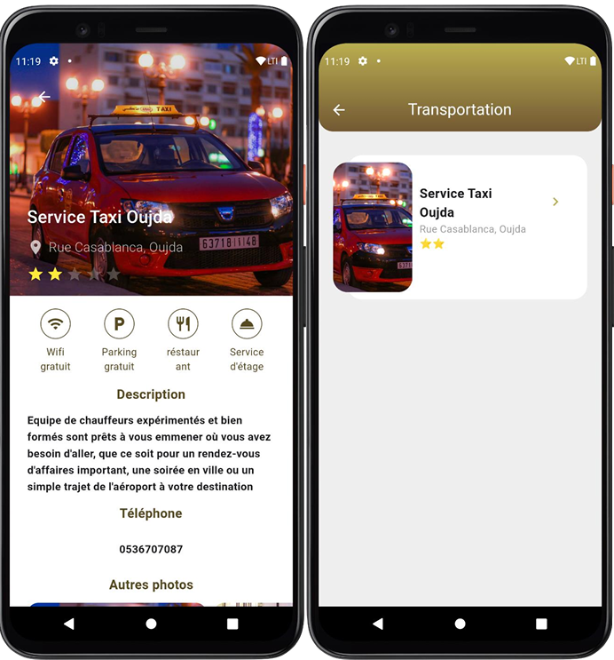 
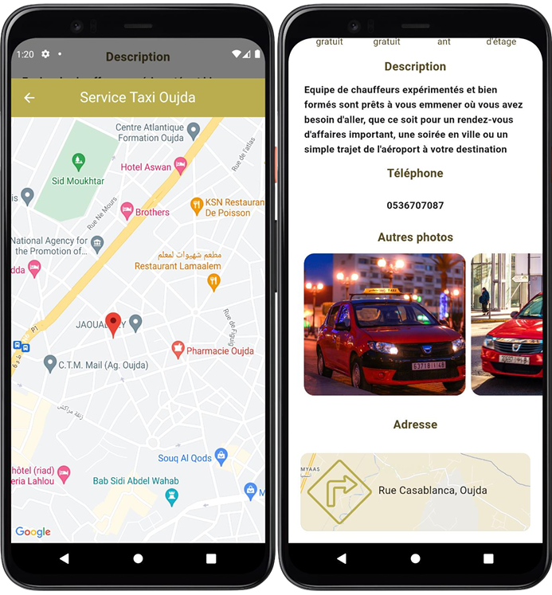 

## 👥 Equipe : 
- Encadrant : M. FIKRI Zakaria
- **CHARI Milouda** - Développeur Full-Stack  

## 📩 Contact
🔗 LinkedIn : [ton-profil-linkedin]  
